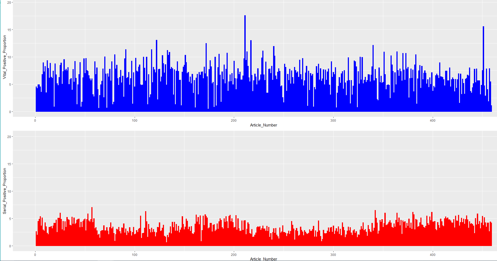
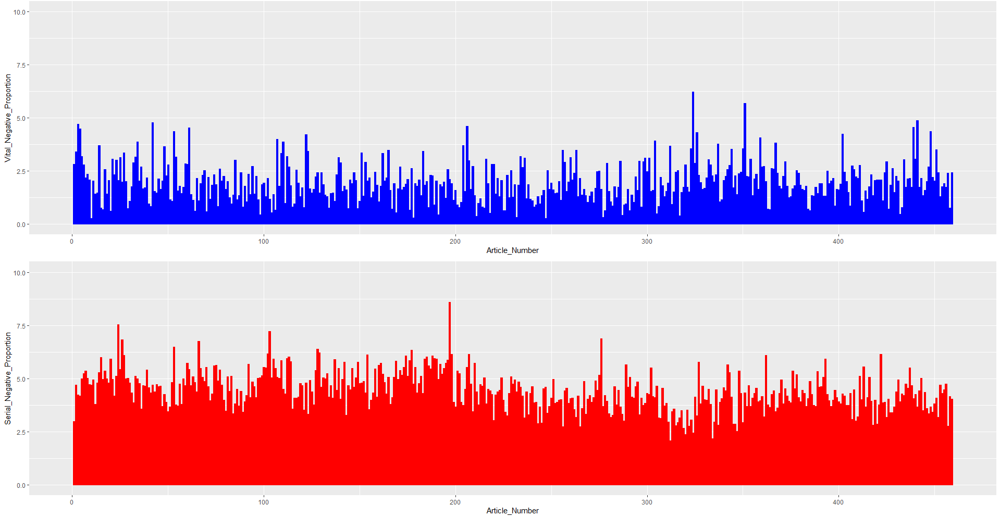
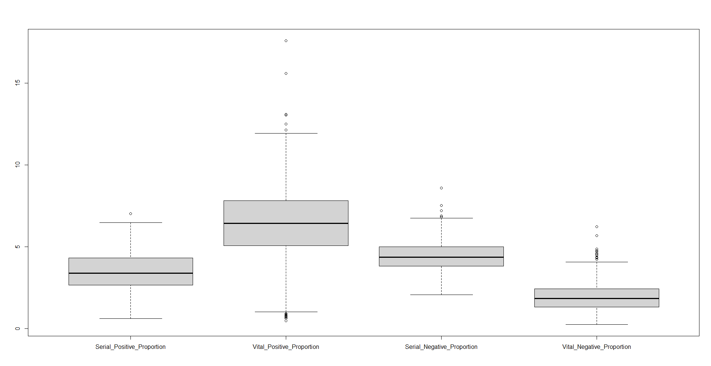

# Wikipedia_NLP_Project_R
Natural Language Processing project on scraped Wikipedia Data using R to analyze about a 1000 articles and test a hypothesis that "Whether words in serial killers articles contain more negative statement than Vital People articles throughout history" 

### Requirements to run and test the project:

To run this project, you will need RStudio, R  installed on the system. 

The reference links are provided below.

> **RStudio:**
  https://www.rstudio.com/products/rstudio/download/

> **R 3.0.1 or higher:**
  http://cran.r-project.org/
	
## Procedure followed in the Project:

   * **Step 1:**
   Data Scraping using Rvest done separately for 500 Serial Killer Wikipedia Articles(https://en.wikipedia.org/wiki/List_of_serial_killers_by_number_of_victims) and 490 Vital People(https://en.wikipedia.org/wiki/Wikipedia:Vital_people) in links_scraping.R . Wikipedia article links for each of these type of people are scraped and stored into an excel file for further process. 
   
   * **Step 2:**
   After removing the stop words from the wikipedia articles of both Vital People and Serial Killers, sentiment analysis(using syuzhet library) of the whole individual articles are done and a percentage of positive, neutral and negative sentiment words is found. This step is done in the sentiment_analysis.R file. 
   
   * **Step 3:**
   The result of previous step is also visualized to test the hypothesis that serial killers have more negative sentiment words written about them when compared to Vital People. This hypothesis is testes using Kolmogorov-Smirnov Test. This step is performed in the other_analysis.R file. 
  
   * **Step 4:**
   In the last part of the project, other analysis based on the Wikipedia data are done such as comparing lengths of articles of vital people vs. serial killers and finding most dominant words in the two above mentioned categories. A wordmap is made in the visualizations.R file.  

  **NOTE:** 
All csv files made and used in the above steps are present in the Data folder.

## Results:

Visualization and Hypothesis test results are shown below. 

### Visualization Results: 

All these analysis are done using both R. Some of the visuals are shown below: 

 
Here, the positive words proportion is compared article wise. It's apparent that serial killers have significant less proportion(by 8-10%) than vital people. 

Here, the negative words proportion is compared article wise. It's clear that serial killers have significant high proportion(4-5%) than vital people. 

Here, using boxplots, overall picture of difference in terms of positive and negative proportion is shown for both serial killers and vital people. This visual also confirms the results we acquired from other visuals and our hypothesis.

Above visuals are taken from Python's matplotlib library results. 

### Hypothesis Results:

Kolmogorov Smirnov Test results for the two categories based on their positive and negative sentiment was done. 

The Kolmogorov Smirnov Statistic quantifies the distance between the empirical distribution function of the two samples. So, the higher it is the more different and far these two samples are. Hence, this statistic also validates that the sentiments of words written about Vital People and Serial Killers is very different and with a good amount of margin.  

  **NOTE:** 
Please note that these figures and visuals have been taken on 04/11/2021. These may differ from the ones you get once you run this project again as data is scraped again and the whole procedure provides similar yet different results.  

